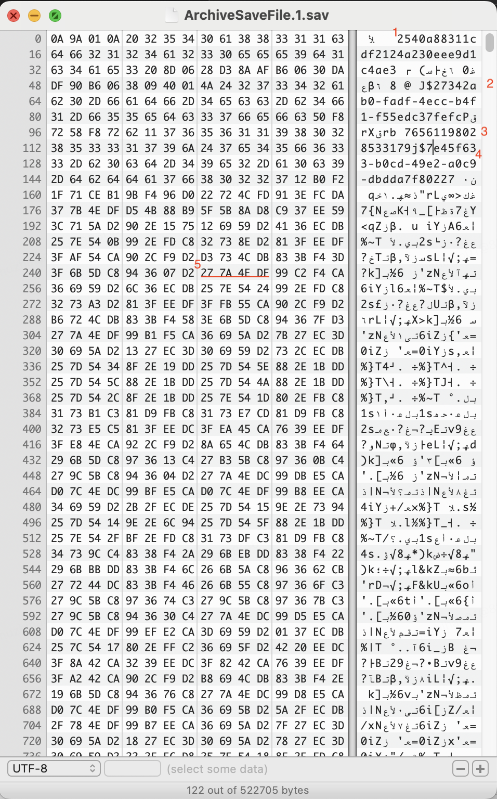
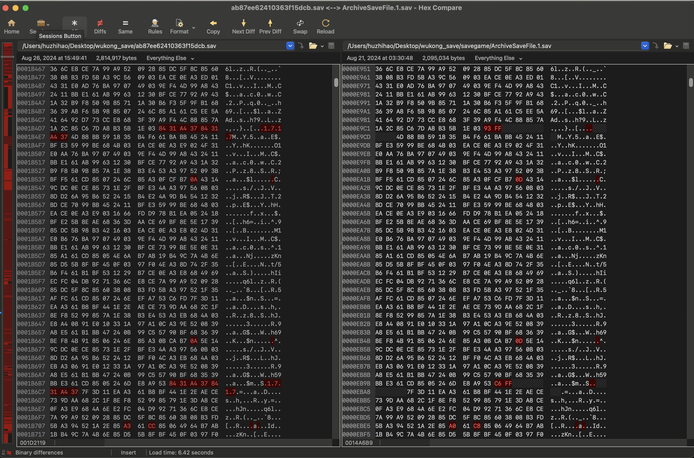

# black-myth-wukong-save-editor (WIP)

UE game save files are usually `GVAS`, infomation i've found in the game save file up to now:

1. seems like some 32-byte key for encryption/decryption

2. the `8-4-4-4-12` format looks like an UUID?

3. steamID

4. another UUID?

5. bytes "27 7A 4E DF" seems like some magic number?

Besides the hex picture above, i tried `binwalk` to check if it's a compressed format(like palworld), but with no luck, if you are also intrested in this project, please let me know

Tried hex-compare tool for two different save files, lots of duplicated codes, the hex string `84 31 A4 37` seems to be [REPLACEMENT CHARACTER](http://www.tachyonsoft.com/uc00FF.htm) in GB-18030.

